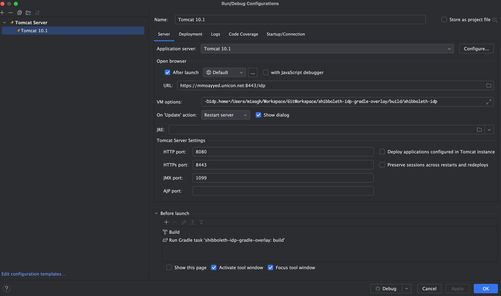
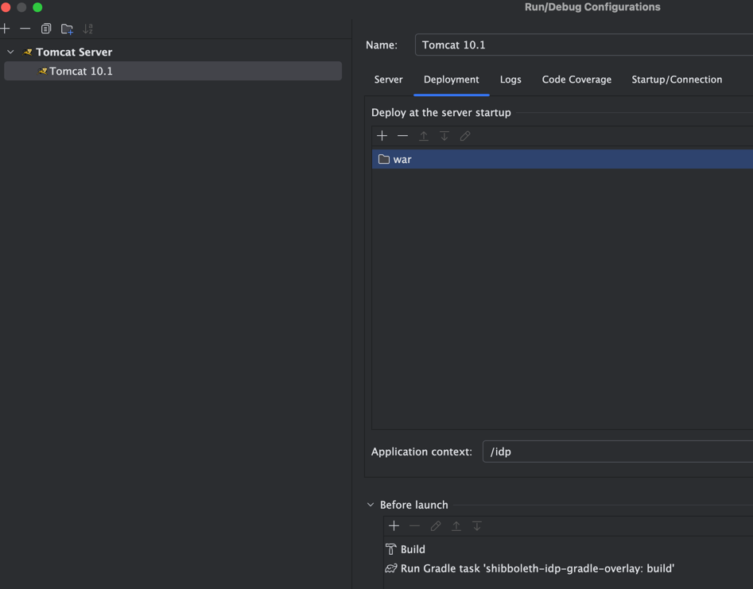
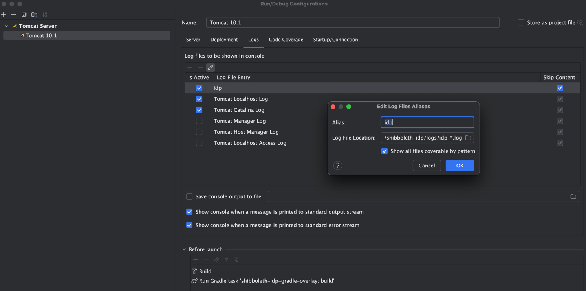

shibboleth-idp-gradle-overlay
=============================
The Shibboleth Identity Provider web application built using a Gradle overlay. 
                
This project is based on Shibboleth Identity Provider `5.1.2`.

## Requirements

- JDK 17+
- Tomcat 10.1+

## Build

Run afterwards:

```bash
./gradlew clean build
```

## IntelliJ IDEA

Create a Run Configuration based on a Tomcat server. If you don't have a Tomcat instance available, [download one](https://tomcat.apache.org/) 
as a zip archive and configure it inside IDEA. When done, select that as the application server in the "Run Configuration" screen.
download one as a zip archive and configure it inside IDEA. When done, select that as the application server in the Run Configuration screen.

### Server

- Specify a URL: `https://org.example.net:8443/idp`
- Add the following VM options:

```bash
-Didp.home=<project-path>/build/shibboleth-idp
```

- For "Tomcat Server Settings", use ports `8080`, `8443` and `1099`.
- For "Before launch" tasks, add `build`.



Your external Tomcat server must have enabled port `8443` in its `conf/server.xml` file:

```xml
<Connector port="8443" protocol="org.apache.coyote.http11.Http11NioProtocol"
           maxThreads="150" SSLEnabled="true"
           maxParameterCount="1000"
           scheme="https" 
           secure="true"
           >
    <UpgradeProtocol className="org.apache.coyote.http2.Http2Protocol" />
    <SSLHostConfig>
        <Certificate
              certificateKeystoreFile="/path/to/thekeystore"
              certificateKeystorePassword="changeit"
              type="RSA"
              />
    </SSLHostConfig>
</Connector>
```

Ensure Tomcat binaries are allowed to execute:

```bash
chmod +x $CATALINA_HOME/bin/*.sh
chmod +x $CATALINA_HOME/bin/*.bat
```

You need to make [JSTL libraries required for JSP files](https://git.shibboleth.net/view/?p=java-idp-tomcat-base.git;a=tree;f=tomcat-base/lib;h=b5fccf2aaefee18d51020a6a221e6059ad668e17;hb=refs/heads/10.1) are also available in the Tomcat's `lib` directory.
Otherwise, you might see an error like this:

```bash
jakarta.servlet.ServletException: Handler dispatch failed: java.lang.NoClassDefFoundError: jakarta/servlet/jsp/jstl/core/Config
	at org.springframework.web.servlet.DispatcherServlet.doDispatch(DispatcherServlet.java:1104)
```

### Deployment

- Add an `External Source` for deployment, and select `<project-path>/build/shibboleth-idp/war`
- Use `/idp` as the application context path.



### Logs

- Select `Tomcat Localhost Log` and `Tomcat Catalina Log`
- Add a new log entry with the alias `idp` and the log file location `<project-path>/build/shibboleth-idp/logs/idp-*.log`
     


### Authentication

Authentication is mocked using a dummy JAAS connector. Use any password/username you like.

### Logs

Logging is controlled by the `logback.xml` file in the `src/main/overlay` directory. `DEBUG` level is turned on by default for a number of packages.
  
### Structure

The project is structured as follows:
         
The base (original) IdP configuration files that would typically be found in a vanilla `/opt/shibboleth-idp` directory are at `src/main/base`.
These files **MUST NEVER** be modified. For all IDP upgrades, these files would be replaced and updated with newer versions. The process would be 
to use the IDP installer to install the IDP once at `/opt/shibboleth-idp`, and then copy the `/opt/shibboleth-idp` directory to `src/main/base`. 
You can skip the `war` directory.
      
Configuration files that would be deployer specific and can be overlaid on top of the base configuration are at `src/main/overlay`. These files
are meant to be modified and override the base.
                                       
No extra IDP plugins are installed.
